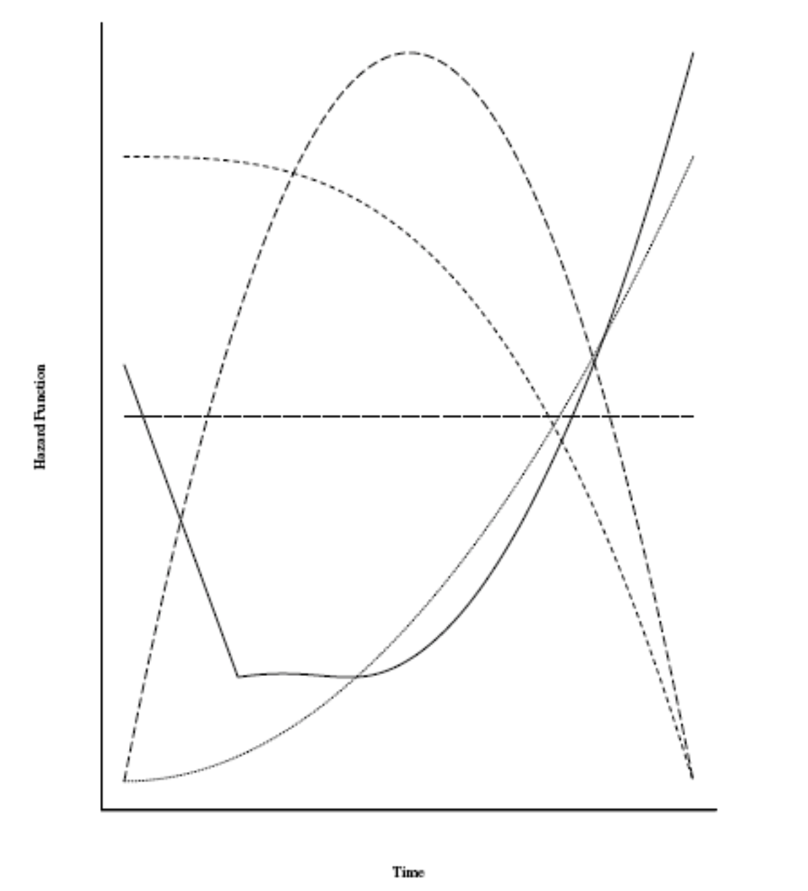
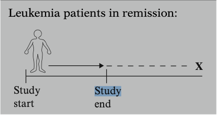
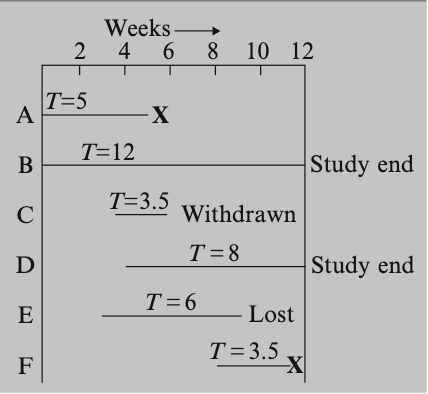

El análisis de supervivencia también conocido como análisis de
confiabilidad o de fallo está conformado por una serie de métodos
estadísticos que estudian problemas particulares en los que la variable
de respuesta de interés es el **tiempo a un evento** determinado. Por
evento nos referimos a cualquier *suceso de interés* que definamos en
nuestro experimento. Por ejemplo, consideremos un análisis clínico dónde
queremos observar la diferencia en mortalidad de cierta patología
pulmonar entre hombres y mujeres.

<br>

```{r, echo=FALSE,warning=FALSE,message=FALSE}

library(tidyverse)
library(survival)
library(survminer)

## Esta gráfica es sólo un ejemplo

fit <- survfit(Surv(time,status) ~ sex, data=lung)

```

```{r, echo=FALSE}
f <- ggsurvplot(fit, data = lung, 
                legend.labs = c('Hombres','Mujeres'))

f$plot
```
<br>

Independientemente de las unidades que definamos como **"tiempo"**
(unidades discretas o continuas). Los datos de tiempo a un evento son
**variables aleatorias no negativas**

Existen métodos que consideran más de un tipo de evento cómo son los
modelos de **Riesgos Competitivos** o los modelos de **Eventos
recurrentes** pero por lo pronto nos vamos a enfocar en los modelos
simples de supervivencia, los cuales estudian un único evento de
interés.

Antes de seguir,

-   Tiempo $\equiv$ Tiempo de supervivencia
-   Evento $\equiv$ Muerte $\equiv$ Fallo

**NOTA:** El análisis de supervivencia fue nombrado así por su
aplicación de bioestadísica pero tiene varios nombres dependiendo el
área de estudio, también es conocido como análisis de confiabidad o de
tiempo de fallo en ingeniería , análisis de evento-historia en
sociología.

<br><br>

## Supervivencia y Riesgo

Rercordando un poco de los cursos de probabilidad, toda variable
aleatoria $T$ está definida por una función de densidad $f(t)$ o por su
función de distribución acumulada $F(t)$. En análisis de supervivencia
utilizaremos habitualmente las funciones de:

-   **Supervivencia**, denotada por $S(t)$.
-   **Riesgo**, denotada por $h(t)$.
-   **Risgo Acumulado**, denotada por $H(t)$.

<br><br>

### Función de Supervivencia.

La función de supervivencia $S(t)$ es la función más importante para
describir el comportamiento de tiempos de falla y se define como la
probabilidad de que un individuo sobreviva más allá del tiempo $t$, es
decir, la probabilidad de que un individuo presente su evento de fin en
un tiempo posterior a $t$. En notación matemática tenemos.

$$ S(t) = P(T>t) = 1 - F(t) $$ Las funciones de supervivencia tienen
propiedad muy bien definidas que deben de cumplirse:

1.  Son monótonas no crecientes.
2.  $S(0) = 1$ y tienden a cero cuando el tiempo tiende a infinito. Es
    decir, todos nos vamos a morir.

La tasa de decaimiento de las funciones de supervivencia varía de
acuerdo al **riesgo** de presentar el evento de fin. Eventos más
riesgosos presentan una tasa de decaimiento mayor.

<br>

```{r,echo = FALSE}
weibull_S <- function(t,lambda= 0.26328 , alfa=0.5){
  S <- exp(-lambda*(t^alfa))
  return(S)
}


weibull_S2 <- function(t,lambda=0.1 , alfa=0.1){
  S <- exp(-lambda*(t^alfa))
  return(S)
}


weibull_S3 <- function(t,lambda= 0.00208 , alfa=3){
  S <- exp(-lambda*(t^alfa))
  return(S)
}


d <- data.frame(t=c(0 ,15))

ggplot(d, aes(t)) + stat_function(fun=weibull_S, color = 2)+ stat_function(fun=weibull_S2, color = 3)+ stat_function(fun=weibull_S3, color = 4) + labs(y = expression("S(t)"))

```

<br><br>

### Función de Riesgo

También conocida como la tasa de falla condicional en análisis de
confiabilidad, tasa de mortalidad en demografía o función de intensidad
en procesos estocásticos. Como lo mencionamos antes, representa la tasa
de cambio en $S(t)$, por lo que la función de riesgo puede ser
definida en terminos de $S(t)$ y viceversa.

Para tiempos **discretos** la función de riesgo está definida cómo
$$h(t) = \frac{f(t)}{S(t)} = 1 - \frac{S(t)}{S(t-1)} $$ 
dónde
$$S(t) = \prod\limits_{k:u_k \leq t}{\frac{S(u_k)}{S(u_{k-1})}} = \prod\limits_{k:u_k \leq t}{(1 - h_k)}$$
y en el caso **continuo** está dada por

$$h(t) = -\frac{d}{dt}\log{S(t)}$$
$$S(t)= \exp{\left(-\int_{0}^{t} h(u)du\right)}$$

el valor de riesgo $h(t)$ se puede interpretar cómo la "probabilidad
aproximada" de que un individuo de edad $t$ experimente el evento
estudiado en el siguiente instante, sin embargo, el valor de riesgo **no
es una probabilidad**. El valor $h(t)$ va de $0$ a $\infty$.

<br>

```{r,echo = FALSE}
weibull_h <- function(t,lambda= 0.26328 , alfa=0.5){
  h <- lambda*alfa*t^(alfa-1)
  return(h)
}


weibull_h2 <- function(t,lambda=0.1 , alfa=0.1){
 h <- lambda*alfa*t^(alfa-1)
  return(h)
}


weibull_h3 <- function(t,lambda= 0.00208 , alfa=3){
  h <- lambda*alfa*t^(alfa-1)
  return(h)
}


d <- data.frame(t=c(0 ,15))

ggplot(d, aes(t)) + stat_function(fun=weibull_h, color = 2)+ stat_function(fun=weibull_h2, color = 3)+ stat_function(fun=weibull_h3, color = 4) + labs(y = expression("h(t)"))

```

<br>

La función de riesgo puede tener formas diferentes

-   Una función de riesgo creciente implica un envejecimiento natural.
-   Una función de riesgo decreciente es menos común pero indica un
    rejuvenecimiento.
-   Más comúnmente son las funciones de riesgo en forma de "tina de
    baño" que representan el riesgo de mortalidad en poblaciones que se
    siguen desde el nacimiento.
    

<br>


```{r, echo=FALSE, out.width="50%",out.height="50%", fig.cap="Funciones de Riesgo"}

```


<br><br>

## Censura

Los problemas de supervivencia deben considerar un problema analítico
clave conocido como **Censura**. La censura ocurre cuando tenemos algo
de información sobre el tiempo de supervivencia inividual pero **no
conocemos el tiempo de supervivencia exacto.** Por ejemplo, consideremos
pacientes con leucemia que tuvieron un seguimiento hasta que tuvieron
remisión que es nuestro evento de interés(En la figura de abajo está
marcado con *X*) Si para un determinado paciente, el estudio termina
antes por salida del estudio sin presentar el evento, por el momento,
para nosotros, el tiempo de superviviencia de este paciente estará
censurado, particularmente estará censurado por la derecha. Existen
otros tipos de restricciones en la información como son las censura por
la izquierda , por intervalos y los truncamientos por la izquierda,
derecha y por intervalos pero están fuera del alcance de esta
introducción.

<br>



<br>

### Censura por la derecha

La *censura por la derecha* es el tipo de censura más común y se define
de la siguiente manera:

Para un individuo específico bajo estudio, la censura por la derecha se
dá cuando el tiempo de supervivencia queda incompleto a la derecha del
periodo de seguimiento, la definiremos formalmente de la siguiente
manera:

-   Sea $C_i$ el tiempo de censura del individuo $i$ . El tiempo de
    fallo $T_i$ es observado si $T_i \leq C_i$, de otra forma sólo
    sabemos que $T_i > C_i$. En presencia de censura por la derecha
    tendremos para cada individuo un par de observaciones
    $(t_i, \delta_i)$, dónde $t_i = min(T_i,C_i)$ y
    $\delta_i = I(T_i \leq C_i)$.

<br>




```{r pressure, echo=FALSE, fig.cap="", out.width = '50%' }
#
```
$\textbf{X} \Rightarrow \it{\,Ocurre\,el\,evento}$

<br>

Usando los datos de la imagen anterior tendríamos algo cómo esto en
formato tabular

```{r, echo=FALSE,message=FALSE }
tabla <- read_csv('TablaSurv.csv')

knitr::kable(tabla,align = "lccrr")
```

<br><br>

### ¿Por qué nos importa la censura?

La censura representa una restricción en la información sobre la que
hacemos análisis, por lo tanto debemos considerarla para corregir los
sesgos en las distribuciones de tiempo que tenemos. Es decir, queremos
incluir en nuestro análisis el hecho de saber que no hemos observado
datos completos y por lo tanto hay "huecos" en la información.

La censura en términos matemáticos representa un reto para definir
funciones de verosimilitud y funciones objetivo.

Usando de ejemplo el data set `lung` del paquete de R `survival` veamos
el impacto de la censura en nuestra estimación de supervivencia.

<br>

```{r, echo = FALSE, message=FALSE}
lung_2 <- lung %>% mutate(status = status - 1) 

con_cens <- lung_2 %>% select(time, status) %>% mutate(Censura = 'Sí')
sin_cens <- lung_2 %>% filter(status == 1) %>% select(time, status) %>% mutate(Censura = 'No')

km <- con_cens %>% bind_rows(sin_cens)


fit_c <-  survfit(Surv(time,status) ~ Censura, data=km)


```

```{r,echo=FALSE}
knitr::kable(lung_2 %>% head(10),align = "lccrr")
```

```{r, echo=FALSE}
f <- ggsurvplot(fit_c, data = km, 
                legend.labs = c('Con Censura','Sin Censura'))

f$plot + geom_hline(yintercept = 0.5)
```

Como podemos ver al ignorar la censura (azul) la curva de supervivencia
ofrece un panorma mucho más optimista que la realidad, en este caso la
censura sugiere que el riesgo es en realidad mucho mayor. Observemos
como la mediana se alnza en puntos distintos en el tiempo.

<br><br>

# Estimador Kaplan-Meier

En la práctica puede ser complicado representar $S(t)$ por eso usualmente obtenemos funciones de
supervivencia estimadas con **funciones escalón**. El estimador máximo verosímil de la función $S(t)$ es el estimador no paramétrico  **Kaplan-Meier**   o  estimador **producto límite**.


Recordemos que 

$$S(t) = \prod\limits_{k:u_k \leq t}{(1 - h_k)}$$

y se puede demostrar que el **EMV** de $h_k$ es 

$$ \hat{h_k} = \frac{d_k}{n_k} $$

dónde $d_k$ representa el número de eventos al tiempo $k$ y $n_k$ representa los individuos en riesgo al tiempo $k$.

por lo tanto sustituyendo en $S(t)$ obtenemos

$$ \prod\limits_{k:u_k \leq t}{(1 -  \frac{d_k}{n_k})}$$


### Análisis KM

Para poder aplicar un análisis KM en R debemos utilizar la función `Surv()` para crear un objeto de supervivencia. Como vimos en los ejemplos anteriores, los objetos de supervivencia tienen dos argumentos indispensables que son **tiempo** y **status** que son nuestros indicadores de tiempo $t_i$ y censura $d_i$.

Para este ejemplo usaremos el dataset `veteran`del paquete `survival` 

<br>


```{r,echo=FALSE}
knitr::kable(head(veteran,10))
```

veamos los valores de tiempo $t_i$

```{r}

library(survival) # Paquete de Supervivencia
library(survminer) # Paquete para visualizar modelos de supervivencia

km <- with(veteran, Surv(time, status))
head(km,80)

```

*Nota:* El símbolo `+` después de los valores de tiempo indican censura.


Para comenzar el análisis, usamos la fórmula `Surv(time,status)~1` y la función `survfit()` para producir el estimador KM para el dataset completo, esto es un panorama general de la supervivencia observada de nuestro dataset.

```{r}
km_fit <- survfit(Surv(time, status) ~ 1, data=veteran)

km_plot <- ggsurvplot(km_fit, data = veteran)

km_plot$plot
```


ahora veamos las curvas por tratamiento

```{r}
km_trt_fit <- survfit(Surv(time, status) ~ trt, data=veteran)

km_plot2 <- ggsurvplot(km_trt_fit, data = veteran)

km_plot2$plot
```

```{r}
km_trt_fit <- survfit(Surv(time, status) ~ celltype, data=veteran)

km_plot2 <- ggsurvplot(km_trt_fit, data = veteran)

km_plot2$plot
```


# Referencias

- *Survival Analysis* David Kleinbaum & Michael Klein
- *Statistical Models and Methods for Lifetime Data* Jerald F. Lawless.
